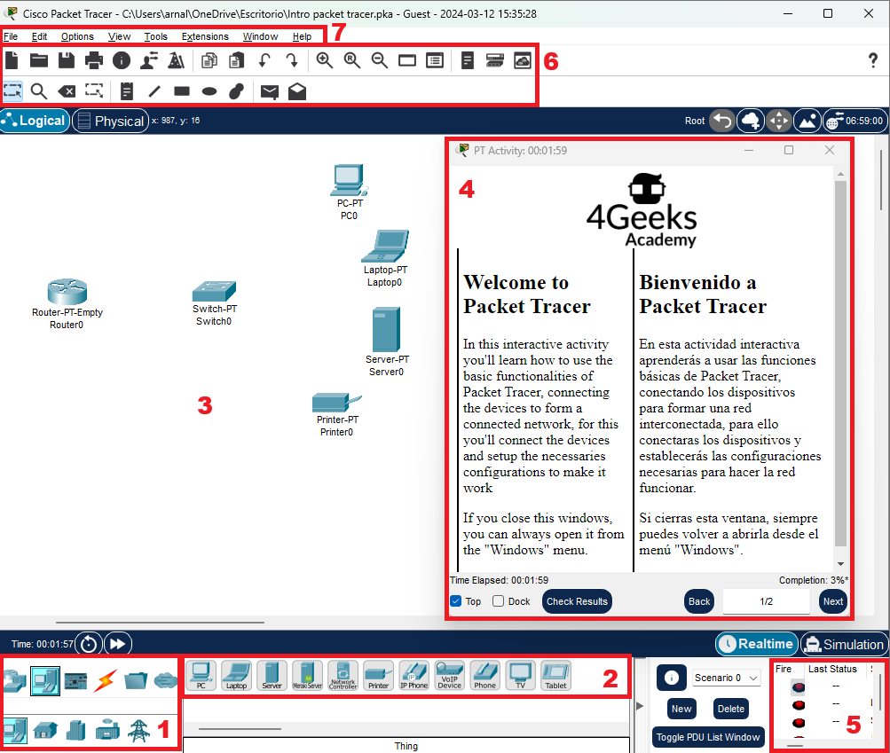

<!--hide-->
# Introduccion a Packet Tracer
<!--endhide-->

Packet Tracer es una herramienta de simulación de redes desarrollada por Cisco. Permite crear redes virtuales completas, con routers, switches, firewalls y otros dispositivos, para luego ejecutar pruebas y simulaciones.

Es una herramienta ideal para aprender sobre redes y ciberseguridad, ya que te permite:

- Experimentar de forma segura: Puedes crear escenarios de ataque sin riesgo para equipos o datos reales.
- Visualizar el tráfico de red: Observa cómo se envían y reciben los datos en la red, lo que te ayuda a comprender mejor cómo funcionan los protocolos y las vulnerabilidades.
- Practicar la resolución de problemas: Puedes enfrentar diferentes tipos de ataques y probar diferentes soluciones para defender la red.
- Aprender sobre diferentes tecnologías de seguridad: Puedes implementar firewalls, sistemas de detección de intrusiones (IDS), y otras medidas de seguridad para proteger la red.

En resumen, Packet Tracer es una herramienta poderosa y versátil que te permite aprender sobre redes y ciberseguridad de forma práctica y segura.

## 🔍 Como instalar Packet Tracer

### Para descargar Packet Tracer

1. Crea una cuenta gratuita en Cisco Networking Academy: https://www.netacad.com/es
2. Inicia sesión en tu cuenta.
3. En el menú superior, selecciona "Recursos".
4. En la sección "Software", haz clic en "Descargar Packet Tracer".
5. Elige la versión compatible con tu sistema operativo (Windows, macOS o Linux).
6. Haz clic en el enlace de descarga y guarda el archivo en tu computadora.

### Para instalar Packet Tracer

1. Ejecuta el archivo de instalación que descargaste.
2. Sigue las instrucciones en pantalla para completar la instalación.
3. Acepta los términos y condiciones de la licencia.
4. Elige la ubicación donde deseas instalar Packet Tracer.
5. Haz clic en "Instalar" para comenzar la instalación.
6. Una vez finalizada la instalación, puedes iniciar Packet Tracer.

## 💻 Interfaz de Packet Tracer

Esta es la ventana de Packet Tracer, vamos a identificar las areas que vamos a trabajar.

1. Tipos de dispositvos
2. Dispositivos
3. Area de trabajo
4. Instrucciones de la actividad
5. Pruebas de conectividad
6. Barra de herramientas
7. Barra de menú

## 📝 Crea tu primera red

[Descarga aquí](./assets/Intro-packet-tracer.pka) la guía interactiva que te guiará en la conexión de tu primera red en Packet Tracer. Con ello aprenderás los fundamentos de esta herramienta que te servirán para el resto del curso, donde tendrás que simular escenarios para análisis de ciberseguridad.
